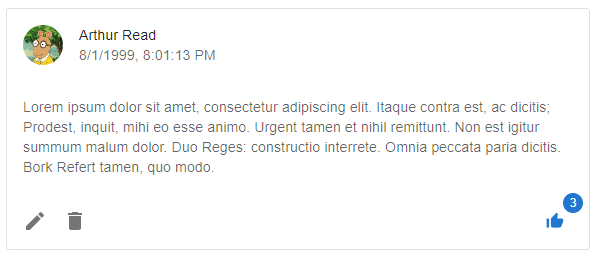
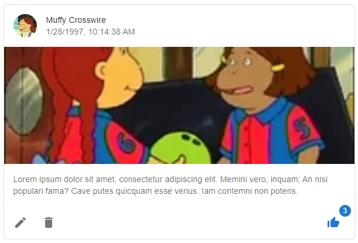

# BriefCam Home Assignment

Before you is the social media app **BriefCam Social**.

Some parts and components have already been implemented, but you can change them as needed.

The database for this exercise is stored in the `server/db` directory in JSON format, which you should access from the server API you will implement.

The app was bootstrapped with Vite, using TypeScript and MUI (Material-UI), as seen in the `package.json` file.

There's no need to install any additional packages. Utilize MUI library UI components whenever possible.

To run the client:

```bash
cd client
yarn
yarn dev
```

If Yarn is not installed, run:

```bash
npm install yarn -g
```

1. **Header Display**

The app's header is already implemented in the Header component, but it currently receives no data, preventing it from displaying correctly. Rectify this by displaying the active user's data.

- Implement a `GET` API to fetch users (`users.json`) and store them in the `users` state in `App.tsx`.
- Implement a method to randomly choose a user ID, and display the selected.
  - IDs vary from 1 to 10 (see `users.json`).
  - A random ID will be selected on mount, and each time the user avatar is clicked, the ID will change.
  - A user ID cannot be selected twice until all IDs are used.
- Display the selected user's data in the `Header` component.

2. **Display Posts**

- Implement a `GET` API to fetch posts (`posts.json`) and store them in the `posts` state in `App.tsx`.
- Sort the posts by date - newest first, either on the client or server side.
- Add the posts list to the element `posts-wrapper` in `App.tsx`.

3. **Post Item Design**

Implement the supplied design for a post item.

- Set the maximum width to `600px`.
- Utilize the `UserAvatar` component for the avatar image. [Bonus: If there is no avatar image, display the user's name initials.]
- Display the date and time in a human-readable manner.
- A post may or may not have an image, display the image if exists.
- Display Edit and Delete actions only for the active user's posts.
- Posts should look like this:




4. **Create New Post**

When clicking the + icon on the top right, a dialog should open to create a new post. The dialog should use the `PostEditor` component.

- Implement multi line text area for content.
- Implement text input for image url.
- Implement action buttons (submit, cancel).
- Implement the action on submit.
- Implement a `POST` API to add a post to `posts.json`.
- Display the new post in the main feed immediately.

5. **Delete a Post**

Only for the active user's posts.

- When the user clicks on the Delete icon in a post, a dialog should appear to verify if the user wants to delete it.
- If confirmed, implement the delete action.
- Implement an API that deletes the post from `posts.json`.
- Display the update in the main feed immediately.

6. **Edit a Post**

Only for the active user's posts.

- When the user clicks on the Edit icon in a post, the `PostEditor` dialog should appear with **this** post's data.
- When clicking on SUBMIT, edit the post; clicking on CANCEL should not change the post.
- Implement an API that edits the post in `posts.json`.
- Display the update in the main feed immediately.

7. **Like Button**

Implement a like button.

- Set the initial counter for all like buttons to 0.
- When clicking the button, the counter should increase by 1, regardless of whether the user already clicked the post's button.
- Store the likes counter in `posts.json`. You can (and should) change the model for the `PostData` type, stored in `types.ts`.

8. **[Bonus] User-based Like Button**

- Each user can click the like button only once. Clicking it again will remove the like from this post for this user.
- When hovering above the like button, display the names of users who liked the post.
